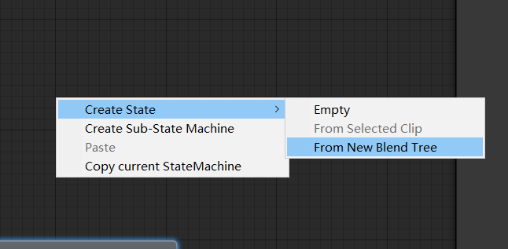
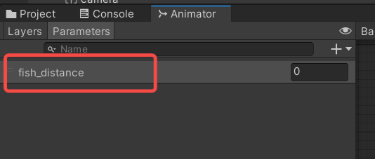
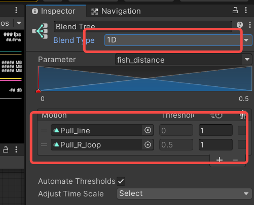
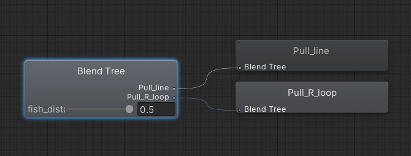

# Blend tree在钓鱼玩法的应用
## 1.blend tree解决的什么问题

一般来说，游戏中很多需求无法通过播放一个动作来解决，例如，在第一人称射击游戏中，射击动作的需求，玩家的目标点，可能在正前方，也可能在斜下方45度，斜上方60度，也可能是-45到60的任何一个角度，动画制作中不太合适每个角度都制作一个特定的射击动画

同样的问题，钓鱼玩法中，鱼和玩家的相对位置，也是一个连续值，当鱼在玩家左侧，会播放向右拉扯动画，鱼在玩家右侧，会播放向左拉扯动画，拉扯的强度也跟鱼和玩家的距离相关，这类问题总结下来就是<strong>动画表现跟一个或者多个数值相关</strong>

## 2.如何使用blend tree

blend tree在unity中是一个特殊的state，创建方法如图，也可以跟基础动画状态机状态一样起名字，blend tree可以同时播放一组动画，通过控制变量来融合多个动画，例如融合0度射击和45度射击，来展示30度射击

### 1.创建belend tree状态

双击进入编辑模式

### 2.创建blend tree的控制变量

### 3.拖入要融合的动画

可以看到设置的属性表达的是，使用一维变量控制，用fish_distance来控制这个融合行为，0完全播放第一个动画，0.5完全播放第二个动画，当设置0-0.5之间的值的时候，会对两个动画进行融合

拖动数值，可以预览动画播放情况

## 3.代码中使用

切换到blend tree的状态跟普通动画一样，使用play(stateName)或者crossfade来切换到blend tree制作的state

设置变量，animator:SetFloat('fish_distance',disRadio)

