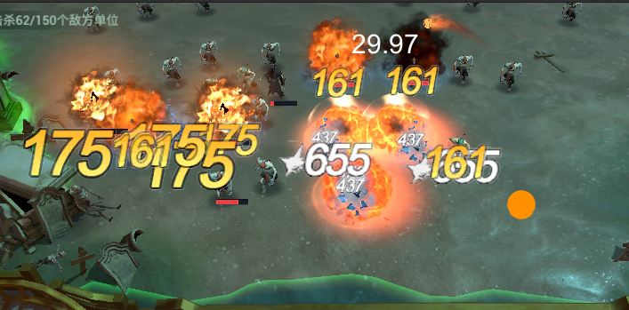
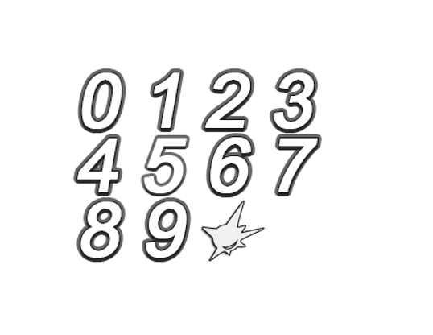
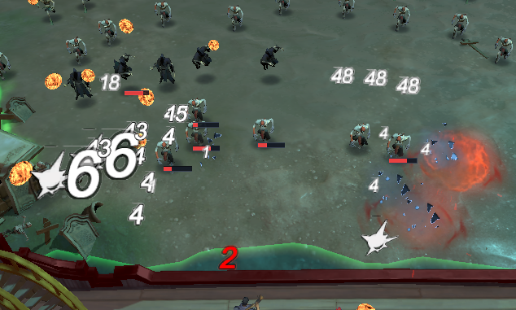
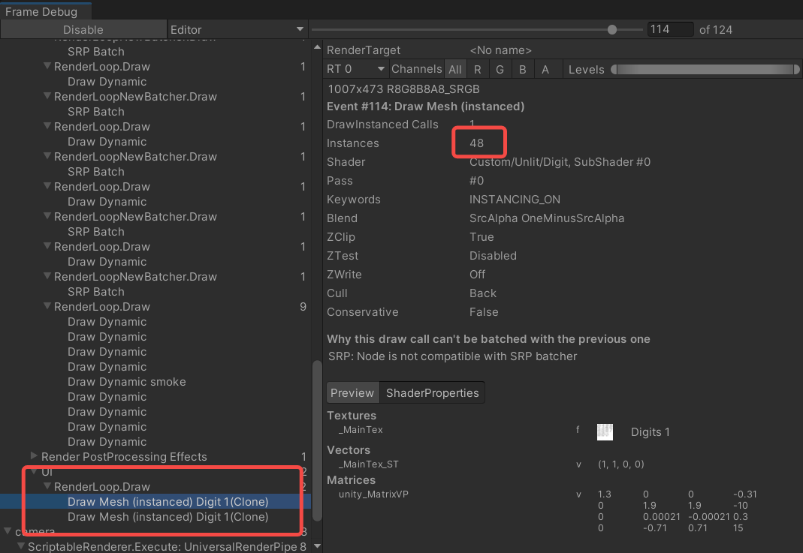

# 战斗玩法大量伤害数字优化


## 1.方案对比
<p>伤害数字的显示，有很多方案，
1.world canvas，unity的canvas是一个相对重型的方案，如果有200个伤害数字实力，就是200个canvas，显然是不可接受的消耗
2.通过代码创建数字mesh来显示伤害，通过unity的动态合批或者我们自己把数字mesh经过排序后合并成一个大的mesh，本质是自己实现动态合批，渲染性能没有问题，但是有一个问题是，每帧都在进行合批操作（因为数字肯定是移动的）
3.将单个数字用一个mesh来表示，使用一个材质，使用material property block来设置差异化，例如颜色等，这种做法的好处是不需要每帧合并mesh，利用unity的instancing机制来合批</p>
目前项目选择的是第三种方案

## 2.如何制作

### 1.制作数字图

<p>数字都放一起，用一张图，一个材质，才可以使用instancing的合批机制</p>

### 2.制作支持数字instancing的材质

关键在于定义那些字段是不同的数字不同的，不同数字的起始uv的行列不同
``` shader
UNITY_DEFINE_INSTANCED_PROP(fixed4, _Color)
UNITY_DEFINE_INSTANCED_PROP(float, _InvRowNum)
UNITY_DEFINE_INSTANCED_PROP(float, _InvColNum)
UNITY_DEFINE_INSTANCED_PROP(float, _RowIndex)
UNITY_DEFINE_INSTANCED_PROP(float, _ColIndex)
```
然后在frag shader里取出这些值进行采样
``` shader
float InvRowNum = UNITY_ACCESS_INSTANCED_PROP(Props, _InvRowNum);
float InvColNum = UNITY_ACCESS_INSTANCED_PROP(Props, _InvColNum);
float RowIndex = UNITY_ACCESS_INSTANCED_PROP(Props, _RowIndex);
float ColIndex = UNITY_ACCESS_INSTANCED_PROP(Props, _ColIndex);
```

代码中设置这些值
``` c#
_mpb.SetColor(_Color, tint);
_mpb.SetFloat(_InvRowNum, 1f / _rowNum);
_mpb.SetFloat(_InvColNum, 1f / _colNum);
_mpb.SetFloat(_RowIndex, _rowNum - 1 - info.rowIndex);
_mpb.SetFloat(_ColIndex, info.columnIndex);
```
每个数字实体有一个material property block，_mpb 用来设置不通的数字的起始uv
### 3.单个数字组成伤害的逻辑
<p>提供一个字符串作为输入，依次提取每个字符所在的uv，设置，创建多个mesh实例，每个mesh是一个数字，根据逻辑计算好每个数字的位置，就拼成一个伤害数字，例如伤害12345，就是由5个mesh组成，分别设置成 1 2 3 4 5不同的起始uv，显示不同的数字</p>

### 4.支持非数字的图标

<p>本质跟数字是一样，只是需要一个符号转义，例如暴击，我用！来代替数字，同时把！对应的uv转换逻辑加入，digit功能本质是把一个字符跟mesh的uv对应上</p>

## 3.渲染性能验证
<p>简单截图了下</p>


可以通过frame debugger清楚看到instancing的合批情况



